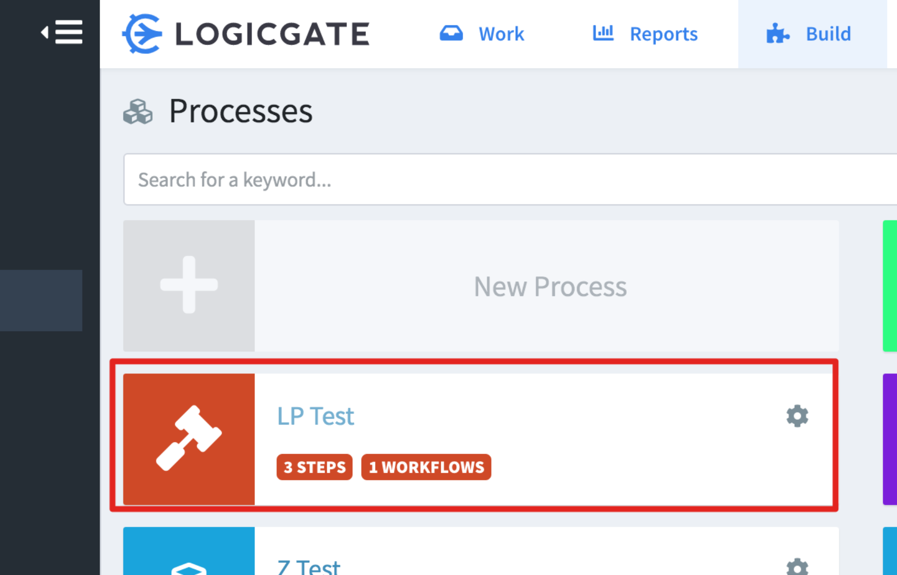
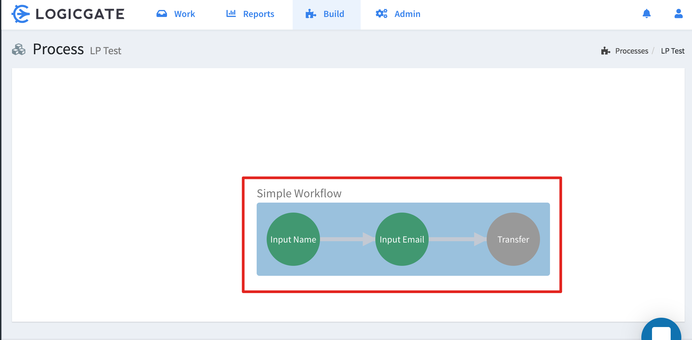
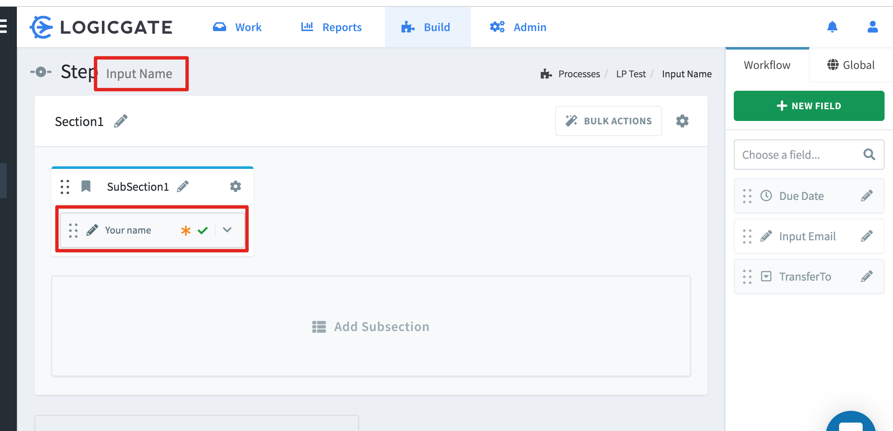
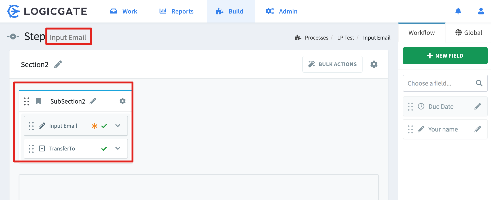
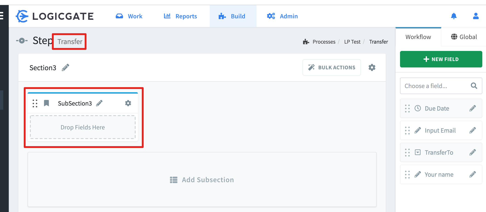
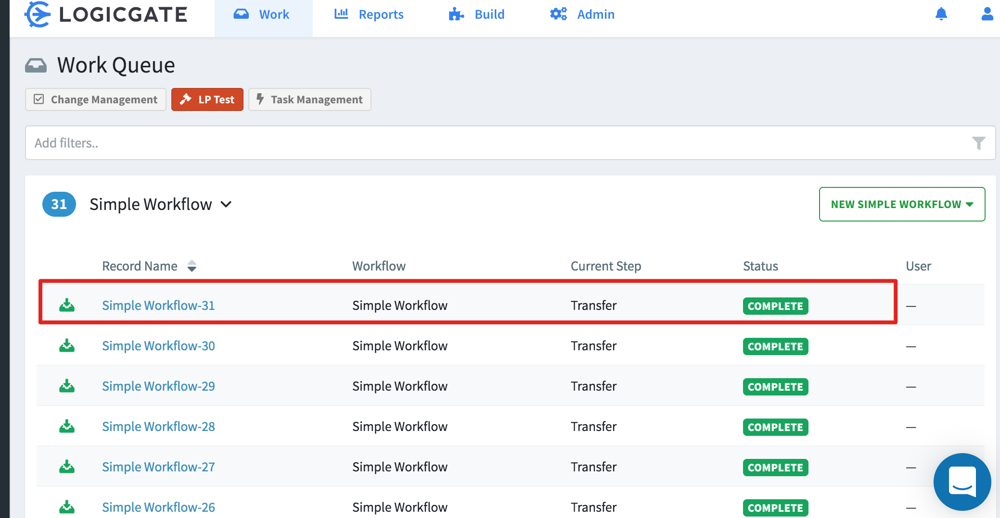
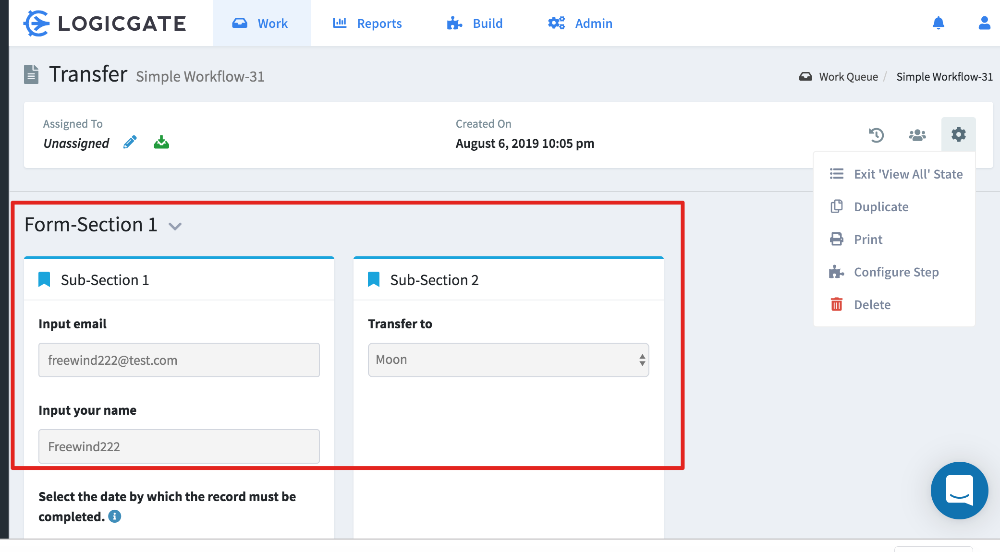

TypeScript LogicGate Create Record Demo
=======================================

Logicgate创建一个record的过程远比想像中的复杂。

开始我以为就像是向一个表中插入一条记录那样简单，然而实际上，在Logicgate中，record与process/workflow/step
等紧紧绑定在一起，所以创建一个新的record，就必须理解这几个相关概念，并拿到相关数据。

- process表示一个完整的业务操作，它里面可以有多个workflow，每个workflow中又有多个step
- 每个record中的字段，是在一个workflow中定义的；在这个workflow中的不同step中，可以使用部分字段来构建该step的form
- 每一个step完成后，都会走向下一个step，record会在不同的step间移动
- 在创建record的时候，必须指明是向哪一个step操作
- 所有这些概念都有id，并且都是全局唯一的

### 创建一个record的流程是这样的：

1. 首先我们需要确定创建在哪一个step中，可以先在浏览器中编辑该step，拿到其id
   - 这里会有一个问题，就是一个record的所有内容可能会经历多个step才能完全填满，怎么办？后面会说明
1. 根据该step id，通过api拿到它相应的workflow id
   - 为什么不先找到workflow id？因为logicgate网站中没有可以看到workflow id的地方
1. 根据workflow id，拿到该workflow中的所有field
1. 从中找到我们需要的field，可以根据name或者id
   - 注意：两个field的name可以相同
1. 根据field的不同类型，构建出需要提交的数据
   - 像text这样的，一般会用到`textValue`这个名字
   - 像select这样的，会从fields中找到需要的option，直接使用它
   - 其它更多类型，还没有测试
1. 使用创建出来的数据，以及step id信息，和accessToken等，向api提交数据

这里可参考Demo中的具体代码

### 如何确定使用哪个step?

当一个record中有多个字段时，很可能它们会在一个workflow中的多个step中分别填写，而且可能在每一个step中都有一些"必填"字段。

比如某一个record，经历以下几个step才完全填完：

    step1 -> step2 -> step3 -> step4

那么我们可能会有疑问：

1. 我们是否需要依次向step1/step2/step3/end中多次提交，才能创建一个record?

    经过我的测试，这样不行。因为每次调用record的那个api，都会创建一个新的record。
（也许有办法可以更新一个已有record，不过我发现可能不需要这么麻烦）

    实际上我们只需要向`step4`提交一次，包含所有需要的字段数据即可。如果单看step4，它这一步可能只需要部分数据，
但是实际上我们提交的额外数据，它也会保存起来。

    如果我们使用的step是前几个（step1/step2/step3)，那么所有的数据也将都会被保存，只是创建完record之后，
这个workflow当前会指向我们指定的step。而如果我们使用step4，那么workflow的状态将变成Complete

2. “必填”数据是否必填？

  - 对于UI操作，必填数据如果没有填，就会提示错误，无法进入下一步
  - 对于api，必填数据没填的话，可以正常提交，只是查看时发现那些字段没有值而已

3. 注意，一般最后一个step里不应该有需要填写的field，否则无法成功提交（也可能我没有找到正确的办法）

## 本Demo使用的workflow

为了简单，本Demo创建了一个只有三个step的workflow，只使用了text与select两种字段。

workflow内容已经导出到 <./resources/exported-process-definition/LP Test.json> 下面，可以导回去。

这里以截图形式，看一下里面的内容：











注意：本来那个select是放在最后一个step(TransferTo)里，后来发现这样无法成功提交数据，
所以把它移到第二个step里了

### 运行：

Create the `account.json` file with content:

```
{
  "baseUrl": "",
  "client": "",
  "secret": ""
}
```

Follow <https://help.logicgate.com/en/articles/1516843-obtaining-an-api-access-token> to get the required data.

- baseUrl: https://your-company.logicgate.com

## Run:

```
npm install
npm run demo
```

如果成功的话，会在logicgate网站中看到多出来一条记录：




